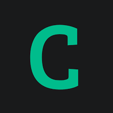

<h1 align="center">Hi 👋, I'm ChenChih</h1>
<h3 align="center">A Software QA on Network and Security  </h3>

- 💻 I'm ChenChih and I am a Software QA Engineer, and I enjoy learning different skills across the software industry in my leisure time, which includes: 
  - FrontEnd, 
  - ＢackEnd
  - Data Science
  - Automation and web Scraping, etc.  
- 📝 I also spend time writing the blog and also surf the Youtube tutorial channel, and see many strong developers. I wish someday I can be like these people.  All of my software skills are learned in my leisure time on the weekend, so time is one of the most valuable things, and I used it wisely. 
- 🤔 I'm not smart and have no software developer experience, but I believe any skill can be learned, and i'm passion of learning 
- 🔭 My expertise and Experience:
  - Network fundamental 
  - Security & vulnerability 
  - Linux setup Ubuntu, RHEL, Kali 
  - Python Automation 

### Goals
- 💻 I’m currently learning **Python and Front End Skills**
- 📝 I like to automation routine stuff to be more productive 
- ⚒  Study **HeXo & HUGO** (SSG static site generator) build my own site
- 🪓 Study Productive tool: Notion, HackMD, obsidian (planning)
### Blog Posts
* [How to create the first python package](https://medium.com/jacklee26/how-to-create-the-first-python-package-de6464799bc3)
* [Python with __name__==__main__](https://medium.com/jacklee26/how-to-create-the-first-python-package-de6464799bc3)
* [Selenium Instagram-followers and following list](https://medium.com/jacklee26/selenium-instagram-followers-and-following-list-52c335a4ec03)
* [How to use github](https://medium.com/jacklee26/how-to-use-git-or-github-ff6f3d5aef0e)

<h3 align="left">Connect with me:</h3>

    

<h3 align="left">Languages and Tools:</h3>

          <a href="https://laravel.com/" target="_blank">          

   <h2> 📈 &nbsp;My GitHub History!</h2>
 
    
   
  

